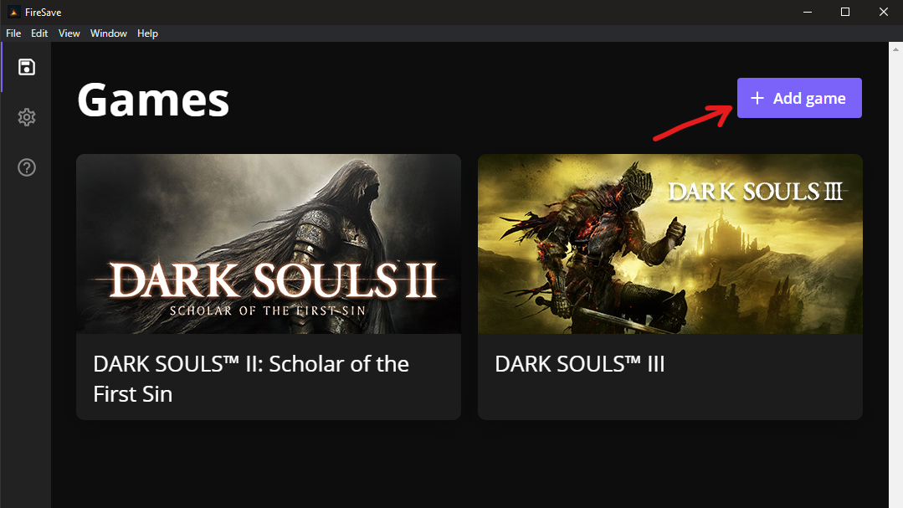
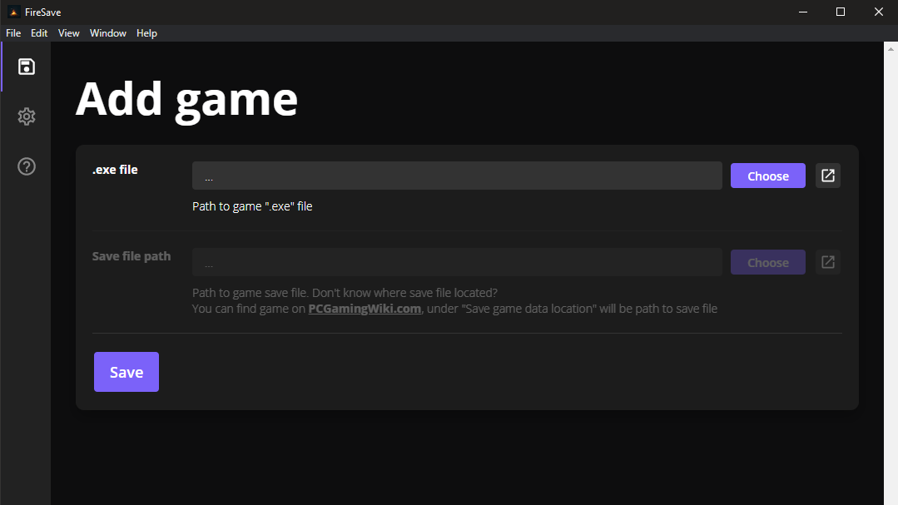
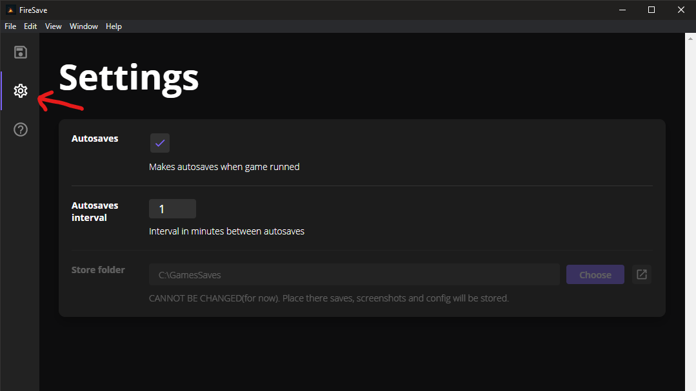
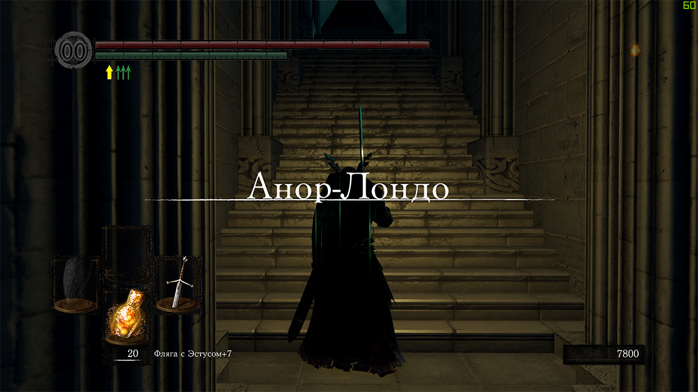

### 1. Add game

### 2. Choose &quot;.exe&quot; file and save file location

### 3. Check settings

### 4. Now you are ready to go - run game

FireSave will save your game automatically only when game is
running, you can press F5 to save game manually(dont work in
fullscreen mode for now, &quot;window&quot; or
&quot;borderless window&quot; only)

